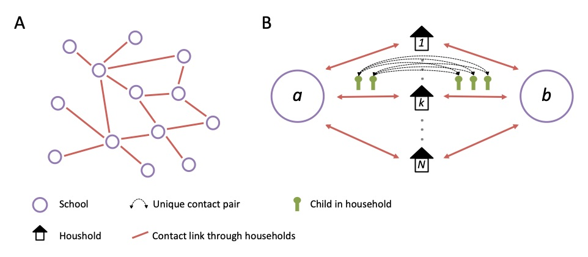
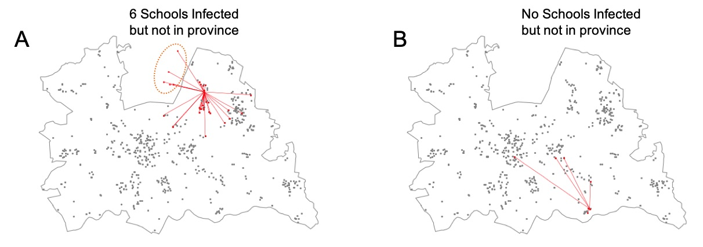
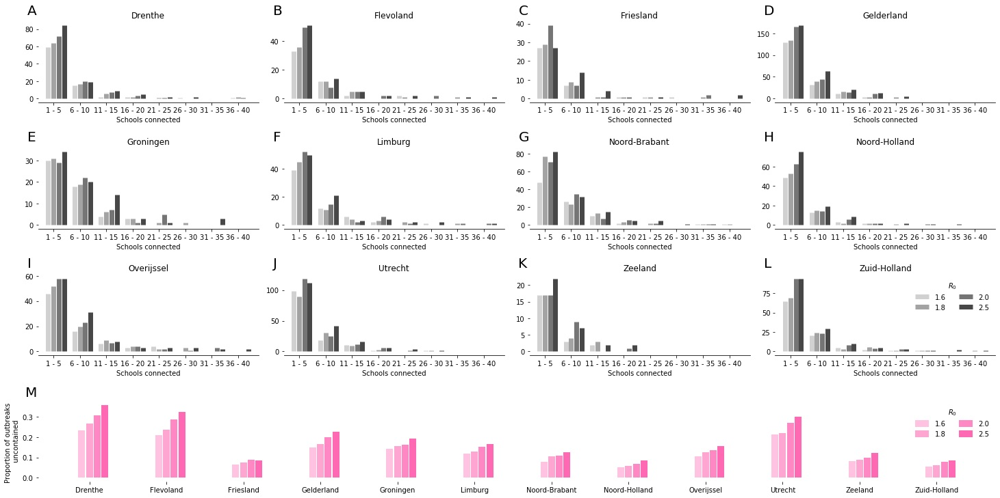
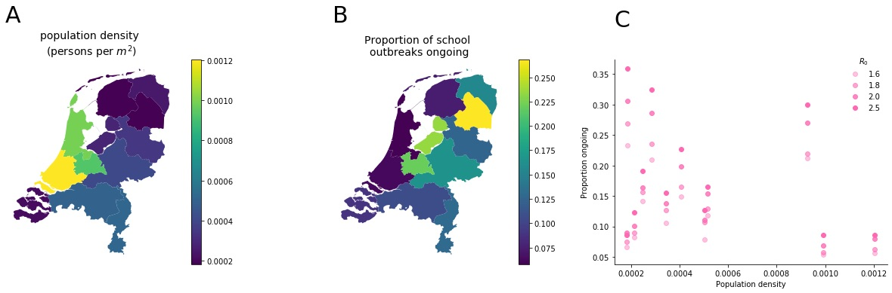
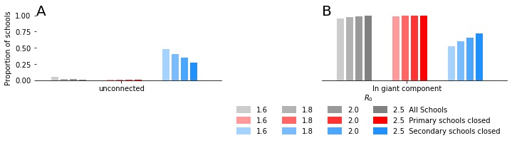

# Evaluation of the impact of targetted school closures on the spread of infectious disease outbreaks using a network of schools: The Netherlands

**Authors:** James D Munday, Mark Meurs, Erik Flure, Sam Abbott, Joel Hellewell, NCov Working Group, Sebastian Funk, John Edmunds, Jacco Wallinga, Albert Jan van Hoek

## Introduction

School closures are often considered as a means of social distancing during an outbreaks. Analyses and experience have shown that school closures can be highly effective interventions if applied at the correct part of the outbreak. There are however significant societal costs associated with closing large numbers of schools for example loss of productivity. Closures can also cost individual households substantially and affects single partent and deprived households most. It is therefore important for policy makers to plan school closures well to minimise the economic and social impact, whist remaining effective in curbing the outbreak.

We use a network model of school and household transmission to explicitly evaluate the impact of various targetted school closure programs on the ability for outbreaks to spread from school to school through housholds. 

## Methods

### A network of schools
To evaluate the relative impact of various targetted school closure interventions, we constructed a network of schools as linked through housholds. Each edge on the school level contact netwrok is weighted by the number of unique contacts between schools that occur through shared households, for example: In household x, 2 children attend school A and 2 children attend school B, there are therefore 4 unique contacts between school A and school B. The sum of all households that form such a link gives the total number of unique contacts between schools A and B, we denote this as $C_{ij}$. 

 

**Figure 1.** *A network of schools linked by households A) A network of schools constructed such that schools are connected when contact is made between pupils of different schools within a household. B) The strength of contact between schools is quantified by calculating the number of unique contact pairs (one child in each school). The number of pairs per household is the product of the number of children who attend school a and the number of children who attend school b. The total number of unique pairs is the sum of unique pairs in each household with children attend both school a and b.*

We estimate the probability of transmission between households as: 

$$ P_{trans, ij} = 1 - \prod(1-P_{ob}P^I_{j}P^S_{i}q)^{C_{ij}} $$

where probability of an outbreak $P_{ob}$ is, 

$$ P_{ob} = 1 - 1/R_{0} $$

and the probability of the member school j in each contact pair being infected $P_{ob}$ is, 

$$ P^I_{j} = R(\infty) = 1 - e^{(R_{0}R(\inf))} $$

Here, $R_{0}$ is the basic reproduction number within school, $R(\inf)$ is the final outbreak size of the school and $q$ is the probability of transmission between children in the same household.

### Simulations on the network

To simulate outbreaks on this netwoek we sample instances of binary transmission networks, where transmission between each pair of schools either occurs (edge weight of 1) of does not occur (edge weight 0). The network final outbreak size is calculated for an outbreak seeded by each school by finding the connected component of the binary transmission network. 

### Evaluating school closures 

#### Regional school closure

To evaluate the relative impact of regional school closures we evaluated the proportion of schools that are expected to seed outbreaks in schools outside of their own region in the first generation of school to school transmission. we evaluate the distribution of the number of schools infected outside of a province within the first generation of an outbreak seeded in a school in that province (Figure 2.). To evaluate the relative effectiveness of regional school closures we estimated the proportion of schools where outbreaks would be seeded outside of the province in the first generation of school to school transmission, hence the outbreak would not be curbed by closing schools at a province level only.

 

 
**Figure 2.** *First generation of infected schools after an initial school outbreak in two Utrecht Schools. A) an outbreak that seeds in X schools including 5 outside Utrecht province suggesting regonal school closures are unlikely to curb within school transmission. B) an outbreak that seeds in X schools including none outside Utrecht province indicating regonal school closures are likely to curb within school transmission. The grey points show the geographical location of all schools in Utrecht. The red graphs show the initial seed and the schools infected in the first generation of school to school transmission in one realisation of the outbreak simulation. The grey line shows the boarder of the province of Utrecht.* 

#### Primary vs Secondary school closure

To evaluate the impact of closing either primary or secondary schools, we extracted subsets of the network with only secondary schools (primary schools closed), or only primary schools (Secondary schools closed). We simuated outbreaks on the network in each region to assess the proportion of children who still attend school that would be affected by the outbreak in each of these school closure scenarios. We also summarise the relative effectiveness nationally by calculating the proportion of schools that remain open which for the giant component of the network and the proportion which are entirely unconnected from other schools in the network. 

## Results 
### Regional school closures

The proportion of schools that seed an outbreak outside of their own province varied between 0.05 and 0.28 for an $R_{0}$ of 1.6, this increased to between 0.07 and 0.35 for $R_{0}$ of 2.5 (Figure 4). This shows substantial variation in potential impact of regional school closures between provinces in the netherlands. There does not appear to be a clear relationship between impact of school closures and population density (Figure 4). 

 

**Figure 3.** *Schools infected outside of the seed school's province. (A - L) histograms of the number of schools outside the province infected per seed school (censored to at least one school outside the province infected), M) Proportion of schools that infect schools outside the province by province. All results for $R_{0}$ values of 1.6, 1.8, 2.0 and 2.5.* 

 
**Figure 4.** *Choropleth of A) population density and B) proportion of schools which sed outbreaks that are not curbed by reactive regional school closure ($R_{0}=1.6)$, C) scatter plot of population density against proportion of outbreaks ongoing for $R_{0}$ of 1.6, 1.8, 2.0 and 2.5.* 

### Primary vs Secondary school closures.

With all schools included in the network all but 80 schools were included in the giant component (>99%) (Figure 5). Closing primary schools had little impact with >99% of schools remaining in the giant component and only a small number of schools are unconnected to the network. Closing secondary schools however greatly reduces the proportion of schools in the giant component to only 45% for an $R_{0}$ of 1.6 to 60% for an $R_{0}$ of 2.0. A large proportion of schools became unconnected to the network, 47% for $R_{0}$ of 1.6 down to 27% for an $R_{0}$ of 2.0.

 
 

**Figure 5.** *Proportion of schools with that are not connected to another school (A) and proportion of schools in the giant component (B) for networks with all schools (grey), with no primary schools (red) and with no secondary schools (blue)*
